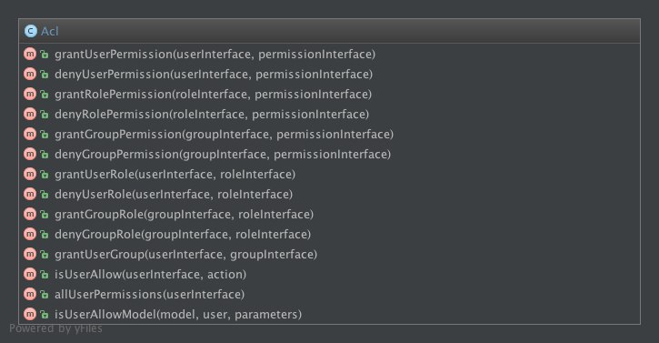
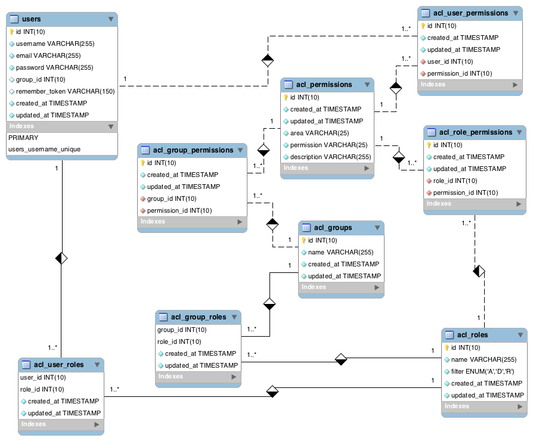

Myo2 
---------

# Get started

## Requirements

    - PHP >= 5.5.9
    - OpenSSL PHP Extension
    - Mbstring PHP Extension
    - Tokenizer PHP Extension
    - Composer
    - node / npm / bower
    - phpunit (dev)

## Install

    - cp .env.example .env
    - For a dev env you need to set `APP_ENV` to `local` and `ASSETS_CONCAT` to `false`
    - composer install
    - php artisan migrate --seed
    - php artisan assets:update
    - php artisan assets:build
    - create a vhost to /public folder or type `php artisan serve` to run php build in server

## Install in a subfolder

If you can't install myo2 at the root of a domain or a subdomain:
In the `env` file uncomment `SUBFOLDER_INSTALLATION` config and specify the right path. 

Example: Myo2 is accessible via http://irlandais.ncy/<Myo2 root folder>, `SUBFOLDER_INSTALLATION` must be set a `/<Myo2 root folder>/public`
Do not forget the initial `/

You need to rebuild assets after changing `SUBFOLDER_INSTALLATION` config.

# Tests
## Run tests
    
Open a terminal at the root of myo2 and run phpunit. 

## Tests groups

Some group of tests are defined:
    - critical : critical feature as login, register...
    - quality : all code quality tools

Example:

    phpunit --groups=critical

Previous command wil only run critical tests.

# Assets management
## Folders

    resources
    ├── assets
    │   ├── bower
    │   │   └── All bower dependencies
    │   ├── css
    │   │   └── Application CSS files
    │   ├── fonts
    │   │   └── Application font files
    │   ├── img
    │   │   └── Application images
    │   ├── js
    │   │   └── Application javascript
    │   ├── less
    │   │   └── Application less files
    │   └── sass
    │       └── Application sass files
    .

For a better readability and maintainability you need to respect this folder pattern. You can create as many subfolders as you want.
/!\ After the building process all fonts will be in the same folder. You need to pay attention to name conflicts.

## Building assets

### Configuration

In the `config/assets.php` file you can define groups of assets:

    'groups' => [
        'style' => [
            \App\Libraries\Assets\Asset::CSS => [
                'resources/assets/css/folder/file.css',
                'resources/assets/bower/bootstrap/dist/css/bootstrap.css',
                'resources/assets/bower/fontawesome/css/font-awesome.css'
            ],

            \App\Libraries\Assets\Asset::LESS => [
                'resources/assets/less/file.less',
                'resources/assets/less/folder/file2.less'
            ],

            \App\Libraries\Assets\Asset::SASS => [
                'resources/assets/sass/file.scss',
                'resources/assets/sass/folder/file2.scss'
            ],

            \App\Libraries\Assets\Asset::FONT => [
                'resources/assets/bower/fontawesome/fonts/*', // only file in this level no subfolders
                'resources/assets/bower/bootstrap/fonts/*',
            ],

            \App\Libraries\Assets\Asset::IMG => [
                'resources/assets/img/folder/*'
            ]
        ],

        'javascript-core' => [
            \App\Libraries\Assets\Asset::JS => [
                'resources/assets/bower/angularjs/angular.js',
            ]
        ],

        'javascript-app' => [
            \App\Libraries\Assets\Asset::JS => [
                'resources/assets/js/*.js',
                'resources/assets/js/*/*.js',
            ]
        ]
    ]

The best practice, for the moment, is to separate style and applicative (JS) files. You can create as many groups you want but it will have an impact on production.
Each js or style group will generate a build file in production.

For the previous configuration, we have, after building, 2 js files ans 1 css file.

For a group, style files are built and concatenated in the order of the group with this priority: LESS then SASS then CSS

In the `.env` file you can change the mode of building you want by setting `ASSETS_CONCAT` to true or false;

### Development building

- less and sass are compiled to css
- css (css, less and sass compiled) are rewritten to fix path (url)
- js, images, and fonts are copied (no modification)

### Production building

- less and sass are compiled to css
- css (css, less and sass compiled) are concatenated and minified
- js are concatenated and packed
- images, and fonts are copied (no modification)

Each style and js groups have a "version" file in `storage/versions`. In this file you can see the detail of each building.

### Command line

If in your `.env` file you set `APP_ENV` to `local` assets building will be done on each request.

#### Cleaning assets

Remove all buildings, versions and temporary files.

`php artisan assets:clean`

#### Building assets

Build all groups, this command runs an asset: clean before the building

`php artisan assets:build`

#### Bower update

Update bower dependencies and remove unused local packages

`php artisan assets:update`

## Include assets in view

For a style group

    <?php
        echo Assets::style(\App\Libraries\Assets\Collection::createByGroup('style'));
    ?>

Output

     <link rel="stylesheet" type="text/css" href="/assets/css/4b2d403006d93f1b598e0499e3866b2c.css">

For a javascript group

    <?php
        echo Assets::javascript(\App\Libraries\Assets\Collection::createByGroup('javascript-core'));
        echo Assets::javascript(\App\Libraries\Assets\Collection::createByGroup('javascript-app'));
    ?>

Output:

    
    

# OAuth

User authentication is based on OAuth 2 for web and api. 
For the moment only oauth2 password with refresh token token is implemented.

If you need more information about OAuth please rtfm: https://tools.ietf.org/html/rfc6749

## Authentication

## Middleware

Before using middleware please rtfm: http://lumen.laravel.com/docs/middleware

### Web
    
If you want to protect a route/group from visitor you need to add the middleware `auth` to your route.
  
        Route::get('protected-resource', ['middleware' => 'auth', function() {
            // return the protected resource
        }]);
    
### Api

If you want to protect a route/group from visitor you need to add the middleware `oauth` to your route.

    Route::get('protected-resource', ['middleware' => 'oauth', function() {
        // return the protected resource
    }]);

## Clients

The application come with 2 production oauth clients; one for the web and one for the api.
Please check the file app/config/oauth2.php to get client_id and client_secret.

PS: those tokens must be changes in production

If you seed your database `php artisan db:seed` in a non production environnement a third client is added with those tokens:

    - client_id versusmind
    - client_secret versusmind

## Scopes

If you want to protect a route/group with a/many scope(s) you need to use this synthax: `oauth:scope1+scope2`

    Route::get('protected-resource', ['middleware' => 'oauth:scope1+scope2', function() {
        // return the protected resource
    }]);

# Acl

Managing access levels  include:

- Every User may have one Group,
- Every User may have many Roles,
- Every User may have many Permissions,
- Every Group may have many Roles
- Every Group may have many Permissions
- Every Role may have many Permissions
- Every Role may have special permission filter, which grant global access to everything (A), deny access to everything (D) or deny to previous granted access (R),
- Every permission may consists of area and action

## Simple ACL permissions/groups/roles

### Database

### Middleware

If you want to protect a route with a permission you only need to specify middleware:

    $app->get('/posts/create', ['middleware' => 'acl:posts.create', 'as' => 'post.create', function () {
        dd('OK');
    }]);

If you want to check more than one permission, use comma to separate.

    $app->get('/posts/create', ['middleware' => 'acl:posts.create,admin.posts', 'as' => 'post.create', function () {
        dd('OK');
    }]);

### API

A REST api is available to manage ACL. With HTTP resources; groups, roles, users, permissions

Actions:

- index : list of models
- store : create a new model
- show :  get a model
- update : update a model
- destroy : delete a model

| Verb   | Path                                           | NamedRoute                 | Controller                          | Action            |
|:------:|:-----------------------------------------------|:---------------------------|:------------------------------------|:------------------|
| GET    | /api/v1/groups                                 | groups.index               | App\Http\Controllers\Api\Group      | index             |
| POST   | /api/v1/groups                                 | groups.store               | App\Http\Controllers\Api\Group      | store             |
| GET    | /api/v1/groups/{id}                            | groups.show                | App\Http\Controllers\Api\Group      | show              |
| PUT    | /api/v1/groups/{id}                            | groups.update              | App\Http\Controllers\Api\Group      | update            |
| PATCH  | /api/v1/groups/{id}                            | groups.update              | App\Http\Controllers\Api\Group      | update            |
| DELETE | /api/v1/groups/{id}                            | groups.destroy             | App\Http\Controllers\Api\Group      | destroy           |
| POST   | /api/v1/groups/{id}/permissions/{idPermission} | groups.permissions.store   | App\Http\Controllers\Api\Group      | permissionStore   |
| DELETE | /api/v1/groups/{id}/permissions/{idPermission} | groups.permissions.destroy | App\Http\Controllers\Api\Group      | permissionDestroy |
| POST   | /api/v1/groups/{id}/roles/{idRole}             | groups.roles.store         | App\Http\Controllers\Api\Group      | roleStore         |
| DELETE | /api/v1/groups/{id}/roles/{idRole}             | groups.roles.destroy       | App\Http\Controllers\Api\Group      | roleDestroy       |
| GET    | /api/v1/roles                                  | roles.index                | App\Http\Controllers\Api\Role       | index             |
| POST   | /api/v1/roles                                  | roles.store                | App\Http\Controllers\Api\Role       | store             |
| GET    | /api/v1/roles/{id}                             | roles.show                 | App\Http\Controllers\Api\Role       | show              |
| PUT    | /api/v1/roles/{id}                             | roles.update               | App\Http\Controllers\Api\Role       | update            |
| PATCH  | /api/v1/roles/{id}                             | roles.update               | App\Http\Controllers\Api\Role       | update            |
| DELETE | /api/v1/roles/{id}                             | roles.destroy              | App\Http\Controllers\Api\Role       | destroy           |
| POST   | /api/v1/roles/{id}/permissions/{idPermission}  | roles.permissions.store    | App\Http\Controllers\Api\Role       | permissionStore   |
| DELETE | /api/v1/roles/{id}/permissions/{idPermission}  | roles.permissions.destroy  | App\Http\Controllers\Api\Role       | permissionDestroy |
| GET    | /api/v1/users                                  | users.index                | App\Http\Controllers\Api\User       | index             |
| POST   | /api/v1/users                                  | users.store                | App\Http\Controllers\Api\User       | store             |
| GET    | /api/v1/users/{id}                             | users.show                 | App\Http\Controllers\Api\User       | show              |
| PUT    | /api/v1/users/{id}                             | users.update               | App\Http\Controllers\Api\User       | update            |
| PATCH  | /api/v1/users/{id}                             | users.update               | App\Http\Controllers\Api\User       | update            |
| DELETE | /api/v1/users/{id}                             | users.destroy              | App\Http\Controllers\Api\User       | destroy           |
| POST   | /api/v1/users/{id}/permissions/{idPermission}  | users.permissions.store    | App\Http\Controllers\Api\User       | permissionStore   |
| DELETE | /api/v1/users/{id}/permissions/{idPermission}  | users.permissions.destroy  | App\Http\Controllers\Api\User       | permissionDestroy |
| POST   | /api/v1/users/{id}/roles/{idRole}              | users.roles.store          | App\Http\Controllers\Api\User       | roleStore         |
| DELETE | /api/v1/users/{id}/roles/{idRole}              | users.roles.destroy        | App\Http\Controllers\Api\User       | roleDestroy       |
| PUT    | /api/v1/users/{id}/group/{idGroup}             | users.group.update         | App\Http\Controllers\Api\User       | groupUpdate       |
| PATCH  | /api/v1/users/{id}/group/{idGroup}             | users.group.update         | App\Http\Controllers\Api\User       | groupUpdate       |
| GET    | /api/v1/permissions                            | permissions.index          | App\Http\Controllers\Api\Permission | index             |
| POST   | /api/v1/permissions                            | permissions.store          | App\Http\Controllers\Api\Permission | store             |
| GET    | /api/v1/permissions/{id}                       | permissions.show           | App\Http\Controllers\Api\Permission | show              |
| PUT    | /api/v1/permissions/{id}                       | permissions.update         | App\Http\Controllers\Api\Permission | update            |
| PATCH  | /api/v1/permissions/{id}                       | permissions.update         | App\Http\Controllers\Api\Permission | update            |
| DELETE | /api/v1/permissions/{id}                       | permissions.destroy        | App\Http\Controllers\Api\Permission | destroy           |

/!\ Need to add ACL + OAuth scope on all those routes

## Owner permissions

If you model can only be list/edit/show/delete by the creator it need to implement the `UserRestrictionInterface`.

## Super Admin

The `App\User` class implement `UserRestrictionCapabilitiesInterface` interface. 
The method `isSuperAdmin` check if the user can bypass all acl and owner permission. 

# Api generator

Myo2 comes with a api generator. For each new model please use the generator to create all classes you need.

    php artisan api:generate {name}
    
name: The model in singular no matter of the case ex: post

    User restricted ? (yes/no) [no]:

Answer yes if you want that only owner / or admin can edit/show/delete/list the model

    Your username []:

You name for the header doc block

    Generate migration/model/repository/controller ? (yes/no) [yes]:

Yes if you want to generate all classes needed, if you say no the tool will ask confirmation for each type.

The command line gives you all files created/ edited. 

Please follow the command instruction given

Before committing please run phpunit. 

# Todo

- Using symlink in the copy task in dev
- Simplify call in view
- Integrate typescript compilator if needed